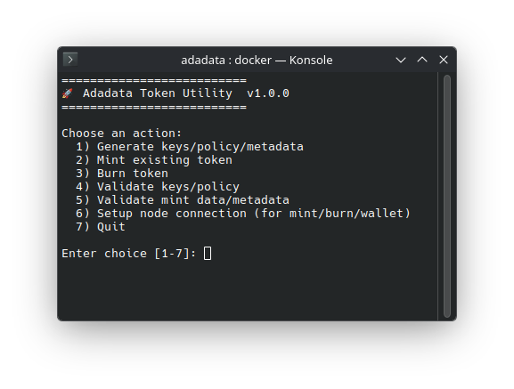
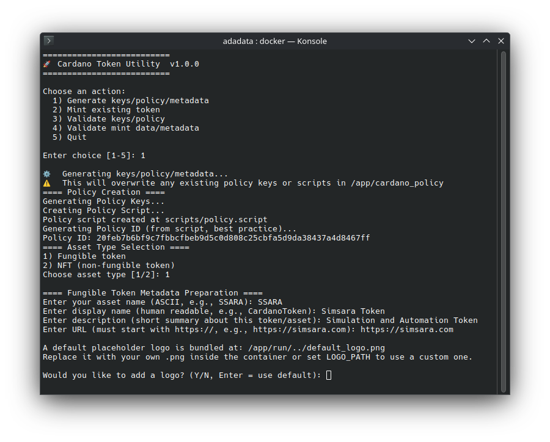
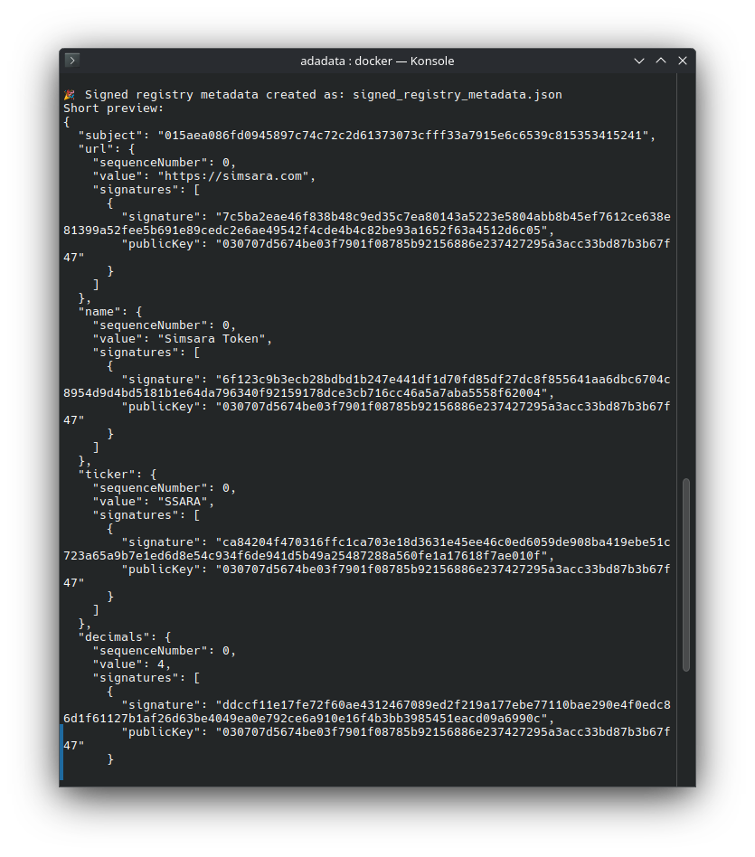
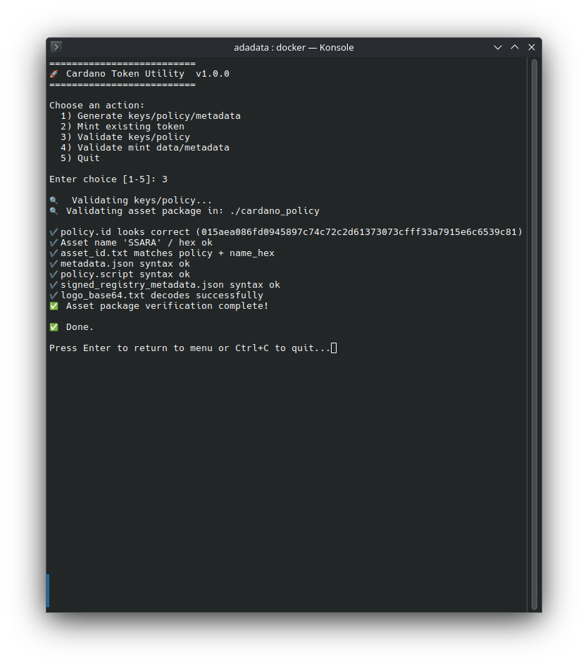
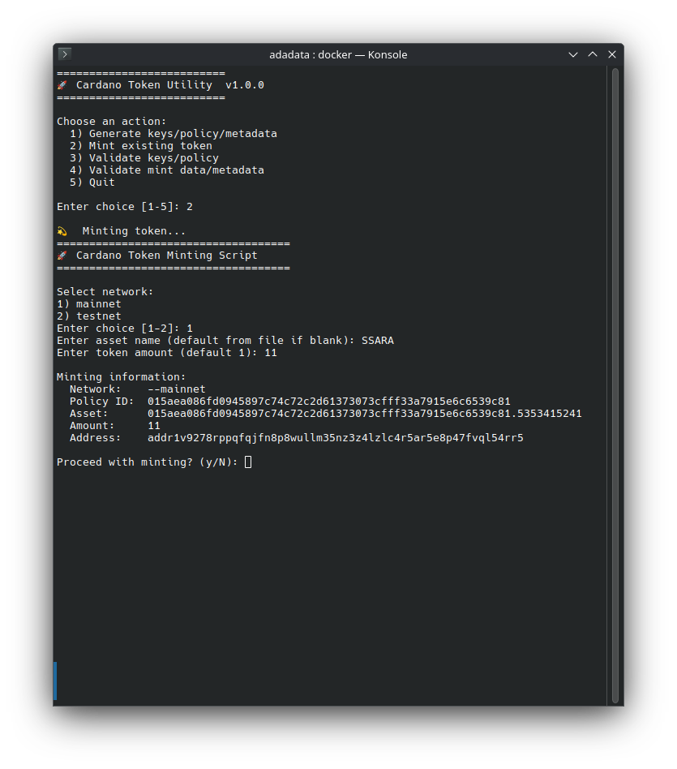

[](https://www.docker.com/)
[](LICENSE)
# AdaData – Air-Gapped Token Metadata Toolkit     


A secure, offline-ready toolkit for creating and managing Cardano token metadata.

AdaData is a self-contained Docker environment for generating and signing Cardano token metadata, designed for fully offline or isolated workflows. We recommend running Docker once to obtain dependencies, then transferring the resulting environment to an air-gapped system for secure use. The offline copy contains everything necessary to generate and sign metadata with zero internet access.
## Table of Contents

- [Support AdaData](#support-adadata)
- [Disclaimer](#disclaimer)
- [Features](#features)
- [Platform Compatibility](#platform-compatibility)
- [Deterministic Builds](#deterministic-builds)
- [Workflow Summary](#workflow-summary)
- [Main Menu Interface](#main-menu-interface)
- [Example Terminal Dialogs](#example-terminal-dialogs)
- [Outputs Directory Structure](#outputs-are-written-to)
- [Dependencies (verified versions)](#dependencies-verified-versions)
- [Alternative (No Docker)](#alternative-no-docker)
- [Directory Layout](#directory-layout)
- [Security Notes](#security-notes)
- [Getting Started](#1-getting-started)
  - [Build the Image](#2-build-the-image)
  - [Run the Container](#3-run-the-container)
- [What AdaData Automates (Reference)](#the-following-cli-are-calls-under-the-hood)
  - [Generate a Policy + Metadata](#generate-a-policy--metadata)
  - [Validate Metadata](#validate-metadata)
  - [Minting Tokens](#minting-tokens)
    - [Build the Mint Transaction](#build-the-mint-transaction)
    - [Sign Transaction (Offline)](#sign-transaction-offline)
    - [Submit Transaction (Online)](#submit-transaction-online)
  - [Verify Mint](#verify-mint)
  - [Burning Tokens](#burning-tokens)
    - [Build Burn Transaction](#build-burn-transaction)
    - [Sign (Offline)](#sign-offline)
    - [Submit (Online)](#submit-online)
  - [Policy Expiration / Lifecycle](#policy-expiration--lifecycle)
  - [Transfer to Air-Gapped System](#transfer-to-air-gapped-system)
- [Author](#author)
- [License](#license)

## Support AdaData
🙏 
If AdaData saves you time, reduces errors, or helps you earn with Cardano—please consider a small ADA contribution!

I’ve many hours (and days!) building, testing, and validating this project so you can achieve secure, end-to-end results in minutes.

Every little bit helps and motivates continued development.
Thank you for your support!

ADA:
addr1q9v8ymz760w2a8ja9g0znchgxf42uj27p8cvx6p2jq9dgt672djtjn96uawdpaq2xn54vr6rkd24ej7rcxz29cly55mqm0vjlp

Much appreciated, and happy building!


---
## Disclaimer
⚠️ Disclaimer
This software is provided AS IS, without warranty of any kind, express or implied. Use at your own risk.

The authors and contributors are not responsible for any loss of funds, private keys, data, or assets that may occur through the use or misuse of this tool.
This tool may use third-party binaries and standard PNG encoding for certain operations.
Always verify any external binaries you download and use with this tool.
If you encode data as PNG files, test and validate your PNG outputs with reputable online tools (such as pngcheck) before relying on them for critical operations or backups.
It is solely your responsibility to perform dry runs in safe environments before executing actual transactions or commands on mainnet.
Always back up your wallets and keep your private keys and recovery phrases secure and private.
Double-check all addresses, commands, and parameters before executing transactions.
By using this tool, you acknowledge that you understand the risks involved.

## Features

| 🚀 Feature | Description |
|-----------|-------------|
| **Interactive Launcher** | User-friendly menu for generating, minting, burning, and validating token data. |
| **Reproducible, Air-Gapped Key and Policy Generation** | Secure creation of wallet and minting keys in an isolated environment. |
| **Metadata and Registry File Creation** | Automatic CIP-68 and registry-compatible metadata generation with options for fungible and NFT tokens. |
| **Built-in Validation and Checksum Verification** | Deterministic hashes for all artifacts, ensuring integrity and reproducibility. |
| **Optional Base64 Logo Embedding** | Supports both embedded base64 logos and remote logo URLs for on-chain or registry logos. |
| **Deterministic Docker Environment** | Version-pinned, fully reproducible builds to ensure consistency and security. |
| **Offline Signing and Minting Workflow** | End-to-end air-gapped token issuance support, including offline transaction signing and submission. |
| **Network Configuration** | Flexible network setup supporting both mainnet and testnet environments. |
| **Wallet and UTxO Management** | Automated wallet balance checks and UTxO selection for streamlined transaction processing. |
| **Comprehensive Metadata Management** | Supports detailed metadata parsing and generation from registry files. |

## Platform Compatibility

AdaData works on all major platforms:
- Docker
- WSL (Windows Subsystem for Linux)
- macOS
- Linux
---

## Deterministic Builds

- Ensures verifiable provenance  
- Eliminates hidden/unpinned dependencies  
- Enables regulatory + security audits  
- Enhances trust across teams  

---


## Workflow Summary


1. Generate wallets + policy keys (offline)  
2. Prepare metadata + assets  
3. Validate + seal artifacts  
4. Build deterministic container  
5. Sign + mint in air-gap, submit online  

---


## Main Menu Interface

[](./img/mainmenu.png)

## Example Terminal Menus


### Preview some example AdaData Terminal dialog screens below. 

##
<details>
<summary> ➡️ Example Terminal Dialogs (click to expand)</summary>(Click to enlarge.)
## 


[](./img/generate.png)
[](./img/mnemonic.png)
[](./img/sig.png)
[](./img/validate.png)
[](./img/minting.png)


</details>

##

Outputs are written to:

```
cardano_policy/
```

```bash
username@username-ms1111:~/adadata$ tree
.
├── cardano_policy
│   ├── asset_id.txt
│   ├── asset_name_hex.txt
│   ├── asset_name.txt
│   ├── b8b4cf5ab56216a90e4b65c510e1e33a5d1e6fc567ba80ff0e99fc5453494d53.json
│   ├── description.txt
│   ├── display_name.txt
│   ├── keys
│   │   ├── payment.addr
│   │   ├── payment.prv
│   │   ├── payment.pub
│   │   ├── payment.skey
│   │   ├── payment.vkey
│   │   ├── policy.id
│   │   ├── policy.skey
│   │   ├── policy.vkey
│   │   ├── root.prv
│   │   └── wallet.mnemonic
│   ├── logo_base64.txt
│   ├── logo_path.txt
│   ├── metadata.json
│   ├── registry.json
│   ├── scripts
│   │   └── policy.script
│   ├── signed_registry_metadata.json
│   └── url.txt
├── db_backup
├── default_logo.png
├── Dockerfile
├── Dockerfile.clean
├── docs
│   └── Abstract.md
├── entrypoint.sh
├── img
│   ├── generate.png
│   ├── mainmenu.png
│   ├── minting.png
│   ├── mnemonic.png
│   ├── sig.png
│   ├── SSARA.png
│   └── validate.png
├── LICENSE
├── NOTICE
├── README.md
├── run
│   ├── ada_env.sh
│   ├── generate.sh
│   ├── inspect_tx.sh
│   ├── launch.sh
│   ├── mint_airgap.sh
│   ├── mint_meta_generator.sh
│   ├── mint_online.sh
│   ├── mint.sh
│   ├── pre_int.sh
│   ├── preview_mint_summary.sh
│   ├── setup_node.sh
│   ├── sign_and_submit.sh
│   ├── validate_keys.sh
│   └── validate_mint.sh
├── tx
│   ├── build.log
│   ├── mint.raw
│   ├── mint.signed
│   └── tx_input_info.txt
└── your_logo.png

```


Back up `cardano_policy/keys/` BEFORE moving or deleting anything.

---

## Dependencies (verified versions)

| Tool | Version | Source |
|------|---------|--------|
| cardano-wallet | v2025-03-31 | CF releases |
| token-metadata-creator | v0.4.0.0 | IOG offchain-metadata-tools |
| metadata-validator | v0.4.0.0 | IOG offchain-metadata-tools |

---

## Alternative Bash CLI (No Docker)

```bash
./scripts/generate-policy.sh
```

This creates:

```
policy/policy.script
keys/policy.vkey
keys/policy.skey
```

---

## Directory Layout

```
keys/                       Offline key pairs
metadata.json               Token metadata
scripts/                    Helper scripts
Dockerfile                  Deterministic build environment definition
cardano_policy/             All generated artifacts
cardano_policy/keys/        Policy + payment keys (SECRET)
cardano_policy/metadata.json Metadata definition
```

---

## Security Notes

- NEVER commit anything inside `cardano_policy/keys/`  
- Container performs **zero outbound network calls**  
- All artifacts are deterministic and reproducible  

---

## 1.  Getting Started

```commandline
git clone https://github.com/simsara-org/adadata.git
cd adadata
```


## 2. Build the image

Note: This project/repo does not include blockchain runtimes/binaries by design, so you can grab the latest.
The docker build step will download necessary binaries, compile the app, and produce an air-gapped image.


```docker build --no-cache -t adadata .```


## 2.5 Ensure your Cardano node is running

AdaData expects a running `cardano-node` and a valid `node.socket`. Primarily for minting and wallet validation

Example (Linux, mainnet):
```bash 
sudo cardano-node run
--topology /home/username/cardano-mainnet/mainnet-topology.json
--database-path /media/username/Elements/username/db
--socket-path /media/username/Elements/username/db/node.socket
--config /home/username/cardano-mainnet/mainnet-config.json
```


## 3. Run the container

**Recommended (runs as your user):**


```commandline
docker run --rm -it \
  --user "$(id -u):$(id -g)" \
  -v "$PWD":/app \
  -v /media/username/Elements/username/db/node.socket:/tmp/node.socket \
  -e CARDANO_NODE_SOCKET_PATH=/tmp/node.socket \
  adadata
```
or
```commandline
docker run --rm -it \
  --user "$(id -u):$(id -g)" \
  -v "$PWD":/app \
  -v /media/username/Elements/username/db/node.socket:/tmp/node.socket \
  -e NETWORK="--mainnet" \
  -e KEYS_DIR=/app/cardano_policy/keys \
  -e TX_DIR=/app/tx \
  -e PAYMENT_ADDR="$(cat cardano_policy/keys/payment.addr)" \
  -e CARDANO_NODE_SOCKET_PATH=/tmp/node.socket \
  adadata
```

## 4. (Optional) Customize the Logo

Personalize your workflow by replacing the default logo with either a local PNG file or an external URL:

- **Option 1: Use a Local PNG File**  
  - **Prepare your logo:**  
    Create a PNG image named `default_logo.png` sized exactly **256×256 pixels**.
  - **Replace the default:**  
    Place your custom `default_logo.png` in the appropriate directory  
    (typically the project root, or wherever `default_logo.png` resides in the project).

- **Option 2: Use an External Logo URL**  
  - **Specify the URL:**  
    If you prefer to use an external logo, specify the URL in your configuration. For example, use `https://simsara.com/logo.png`.
  - **Configuration Example:**  
    Update your configuration file or environment variable to include the logo URL. Ensure that your application is set up to fetch and display this URL as needed.

- **Restart the app (if running):**  
  Your custom logo will now appear wherever the logo is used.

##

> **Tip:**  
> For the best appearance, ensure your image is exactly **256×256 pixels** and a reasonable file size.

---
# The following cli are calls (UNDER THE HOOD)
Note:
You do not need to run these commands yourself when using the AdaData menu; they are provided here for transparency and reference.
For further CLI reference, see the official Cardano CLI documentation.

<details>
<summary>➡️ <strong>Show Full Cardano CLI Workflow (click to expand)</strong></summary> 

# Generate a Policy + Metadata

Inside the container:

```
cardano_policy/
├── keys/
│   ├── policy.skey
│   └── policy.vkey
├── metadata.json
└── policy.script
```

---

# Validate Metadata

```bash
./scripts/validate.sh cardano_policy/metadata.json
```


### Minting Tokens

### Build the mint transaction

```bash
cardano-cli transaction build \
  --babbage-era \
  --testnet-magic 1097911063 \
  --tx-in <TX_HASH>#<TX_IX> \
  --tx-out "$(cat payment.addr)+1500000+1000 <POLICYID>.<TOKENNAME>" \
  --mint "1000 <POLICYID>.<TOKENNAME>" \
  --minting-script-file cardano_policy/policy.script \
  --metadata-json-file cardano_policy/metadata.json \
  --change-address "$(cat payment.addr)" \
  --out-file matx.raw
```

## Sign Transaction (offline)

```bash
cardano-cli transaction sign \
  --signing-key-file payment.skey \
  --signing-key-file cardano_policy/keys/policy.skey \
  --tx-body-file matx.raw \
  --out-file matx.signed
```

## Submit Transaction (online)

```bash
cardano-cli transaction submit \
  --tx-file matx.signed \
  --testnet-magic 1097911063
```

---

# Verify Mint

```bash
cardano-cli query utxo \
  --address "$(cat payment.addr)" \
  --testnet-magic 1097911063
```

---

# Burning Tokens

Burning = minting with a negative amount.

## Build burn transaction

```bash
cardano-cli transaction build \
  --babbage-era \
  --testnet-magic 1097911063 \
  --tx-in <TX_HASH>#<TX_IX> \
  --tx-out "$(cat payment.addr)+1500000" \
  --mint "-1000 <POLICYID>.<TOKENNAME>" \
  --minting-script-file cardano_policy/policy.script \
  --change-address "$(cat payment.addr)" \
  --out-file burn.raw
```

## Sign (offline)

```bash
cardano-cli transaction sign \
  --signing-key-file payment.skey \
  --signing-key-file cardano_policy/keys/policy.skey \
  --tx-body-file burn.raw \
  --out-file burn.signed
```

## Submit (online)

```bash
cardano-cli transaction submit \
  --testnet-magic 1097911063 \
  --tx-file burn.signed
```


# Transfer to Air-Gapped System

Copy the entire directory:

```
cardano_policy/
```

This contains everything needed offline: keys, metadata, policy, hashes, fingerprint logs, etc.

---


</details>

---

# Policy Expiration / Lifecycle

If your `policy.script` includes a `before` slot, minting/burning is allowed **only until that slot**:

Example:

```
{
  "type": "all",
  "scripts": [
    { "type": "sig", "keyHash": "<hash>" },
    { "type": "before", "slot": 12345678 }
  ]
}
```

After slot `12345678`:

- You **cannot mint** more tokens  
- You **cannot burn** tokens  
- Supply is permanently fixed  

If no `before` clause exists, your policy is **open**, allowing mint/burn anytime.

---


# Author

Patrick Peluse (@simsara-official)  
Simsara Org — secure Cardano tooling  

---

# License

Apache-2.0  
See `LICENSE` and `NOTICE`.

